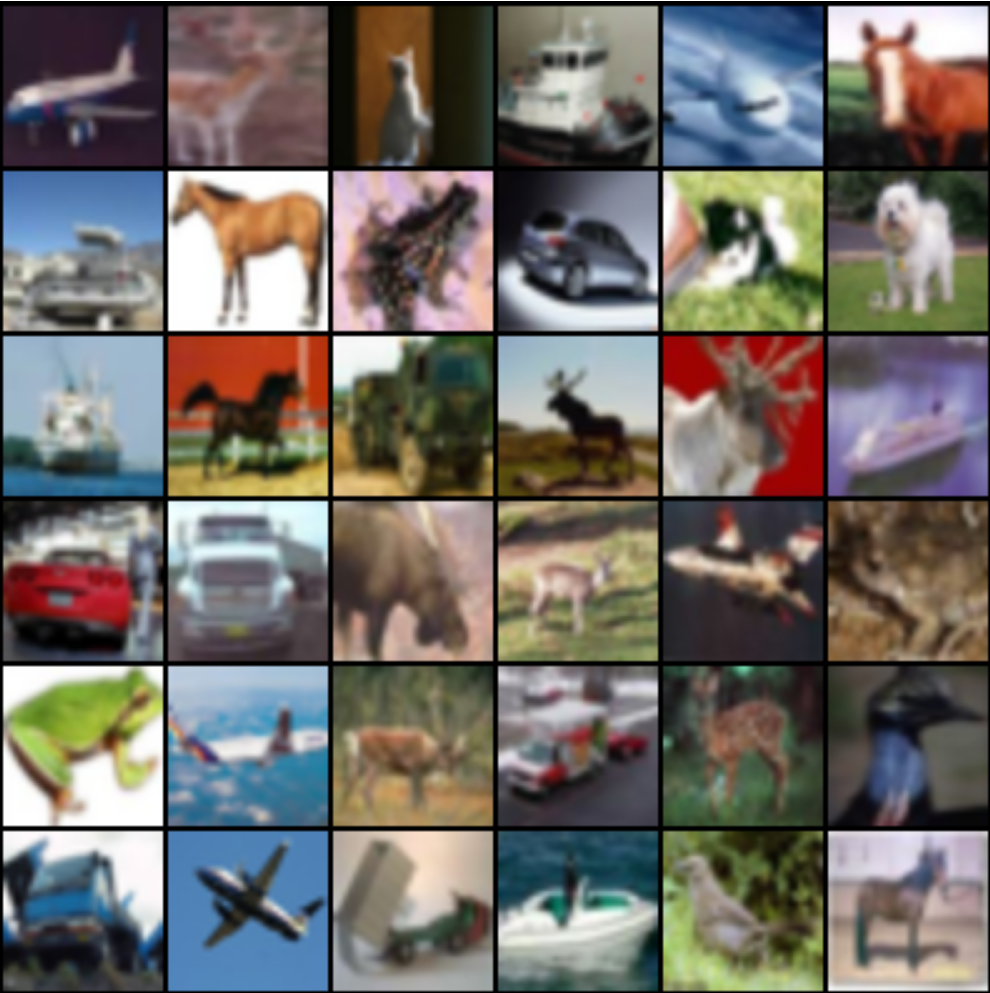

# Image generation with GAN

This module demonstrates a simple image generation network that was trained on CIFAR-10.
You will also learn how to use OpenVINO in Python.
To complete this module you should implement:

1. `generate` method runs network with input random noise
2. `postprocess` procedure that applies some transformations to output of the network to get the final generated image.
3. Generate images and add it to the pull request description.

    
    

## Details

* Download converted model from here:

  * [cifar_generator.xml]()
  * [cifar_generator.bin]()

* Setup OpenVINO environment

    * Linux

        ```bash
        source /opt/intel/openvino/bin/setupvars.sh
        ```

    * Microsoft Windows

        ```bat
        "C:\Program Files (x86)\IntelSWTools\openvino\bin\setupvars.bat"
        ```

* Run a test Python script:

    ```
    python3 test_generation.py
    ```

* Do not add `.xml` and `.bin` files into commit - they are downloaded automatically on CI
