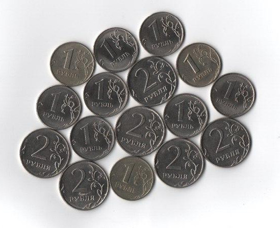

# OpenCV

This module demonstrates basic methods from OpenCV.
To complete this module, you should implement:

1. `countCoins` method which counts a total sum of numbers on the coins on a test image.
    Use coins radius as a criteria for classification.

    

## Details

* Implement an algorithm described in tutorial https://docs.opencv.org/master/d3/db4/tutorial_py_watershed.html

* Use https://docs.opencv.org/master/ to read about used methods
