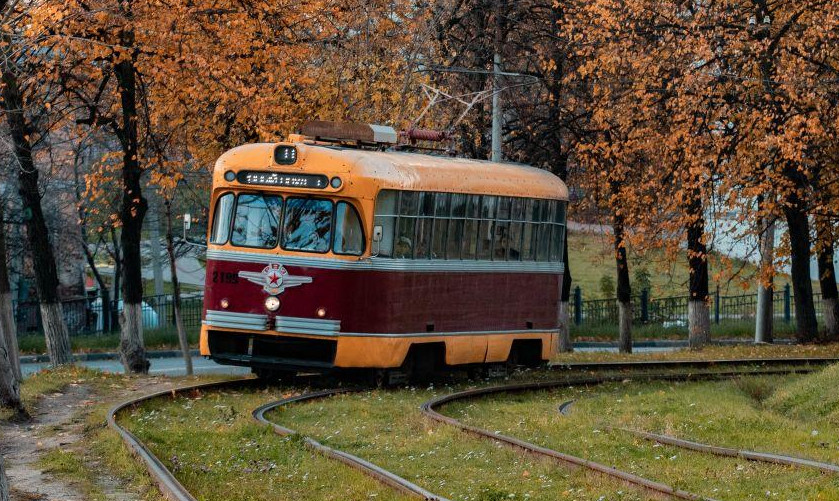

# Image classification

This module demonstrates image classification based on [DenseNet-121](https://arxiv.org/abs/1608.06993)
deep learning network. To complete this module, you should implement:

1. `topK` method which returns top K values in descending order
2. `SoftMax` procedure which maps set of floating point values by the following formula:

    

3. Run classification network with a test image and get correct prediction:

    

    ```
    class: streetcar, tram, tramcar, trolley, trolley car (96%)
    ```

## Details

* Download trained image classification network named DenseNet-121 from https://github.com/shicai/DenseNet-Caffe:

  * [DenseNet_121.prototxt](https://raw.githubusercontent.com/shicai/DenseNet-Caffe/master/DenseNet_121.prototxt)
  * [DenseNet_121.caffemodel](https://drive.google.com/open?id=0B7ubpZO7HnlCcHlfNmJkU2VPelE)

* Run OpenVINO Model Optimizer to convert model

    * Linux
    ```bash
    /opt/intel/openvino/deployment_tools/model_optimizer/mo.py \
        --input_model DenseNet_121.caffemodel \
        --input_proto DenseNet_121.prototxt \
        --scale_values "[58.8235294117647]" \
        --mean_values "[103.94,116.78,123.68]"
    ```

    * Microsoft Windows
    ```bat
    "C:\Program Files (x86)\IntelSWTools\openvino\deployment_tools\model_optimizer\mo.py" ^
        --input_model DenseNet_121.caffemodel ^
        --input_proto DenseNet_121.prototxt ^
        --scale_values "[58.8235294117647]" ^
        --mean_values "[103.94,116.78,123.68]"
    ```

* Put `DenseNet_121.xml` and `DenseNet_121.bin` to `openvino_practice/data` folder.
