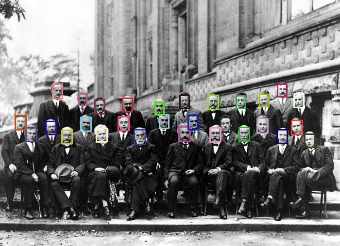

# Object detection

This module demonstrates object detection based on Intel's [face-detection-0104](https://github.com/opencv/open_model_zoo/blob/master/models/intel/face-detection-0104/description/face-detection-0104.md)
deep learning network. To complete this module, you should implement:

1. `Non-maximum suppression` method which filters bounding boxes by confidence and overpal thresholds

    ```
    0.9                    Example of NMS procedure:
    +--------+             1. Two bounding boxes with 0.9 and 0.8 confidence
    |  +--------+ 0.8      2. Intersection Over Union (IoU) more than threshold
    |  |     |  |          3. Keep the most confident bounding box (0.9) and suppress another
    |  |     |  |
    +--|-----+  |
       +--------+
    ```

2. `detect` procedure which performs object detection with OpenVINO

    


## Details

* Download weights file and put to `openvino_practice/data` folder:

  * [face-detection-0104.bin](https://download.01.org/opencv/2020/openvinotoolkit/2020.3/open_model_zoo/models_bin/1/face-detection-0104/FP32/face-detection-0104.bin)
