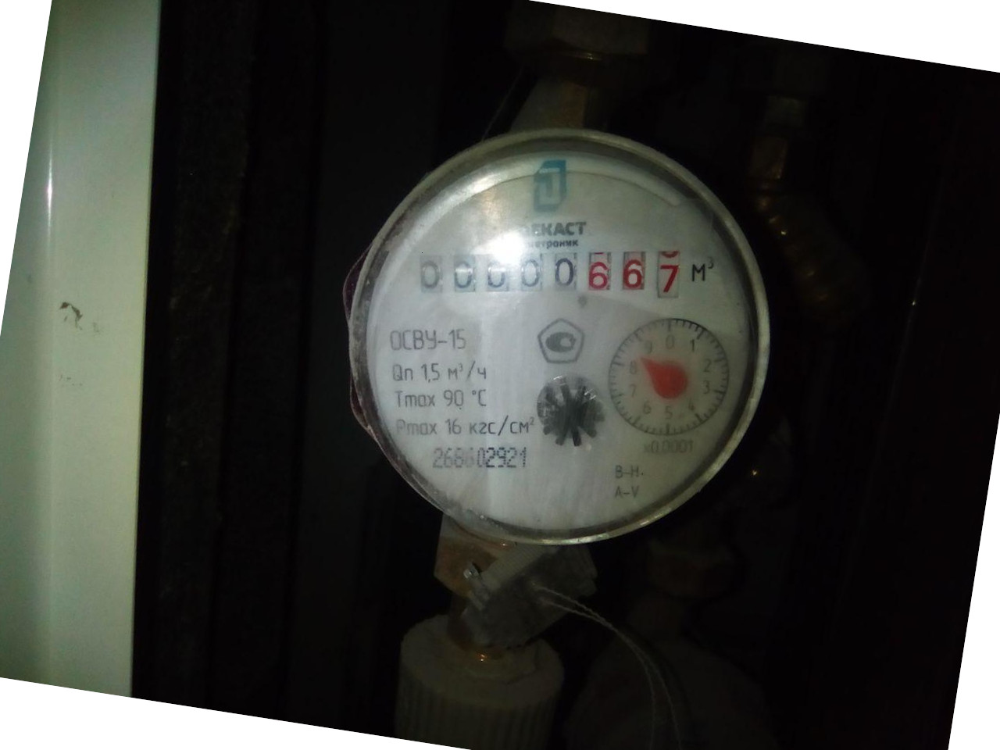
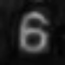

# Digits recognition on MNIST

This module demonstrates classic task of computer vision - Optical Character
Recognition (OCR). K-nearest neighbor classifier is used for practice.
To complete this module, you should implement:

1. [MNIST dataset](http://yann.lecun.com/exdb/mnist/) loaders for images and labels.  
2. `prepareSamples` - dataset preparation procedure
3. `train` method to train K-nearest classifier on MNIST dataset
4. `validate` method to compute accuracy over test subset of MNIST
5. `predict` method to create a pipeline for water counter OCR:

    

## Details

* Download MNIST dataset (unpack by 7-Zip) and put to `openvino_practice/data` folder:

  * [train-images-idx3-ubyte.gz](http://yann.lecun.com/exdb/mnist/train-images-idx3-ubyte.gz)
  * [train-labels-idx1-ubyte.gz](http://yann.lecun.com/exdb/mnist/train-labels-idx1-ubyte.gz)
  * [t10k-images-idx3-ubyte.gz](http://yann.lecun.com/exdb/mnist/t10k-images-idx3-ubyte.gz)
  * [t10k-labels-idx1-ubyte.gz](http://yann.lecun.com/exdb/mnist/t10k-labels-idx1-ubyte.gz)

* Use predefined boundung boxes to extract digits from a water counter image.
To convert color red digits to grayscale, use Saturate component from HSV
colorspace.

    BGR | Saturate (HSV)
    ---|---
     | 

* Do not add the dateset into commit (it is downloaded automatically on CI)
