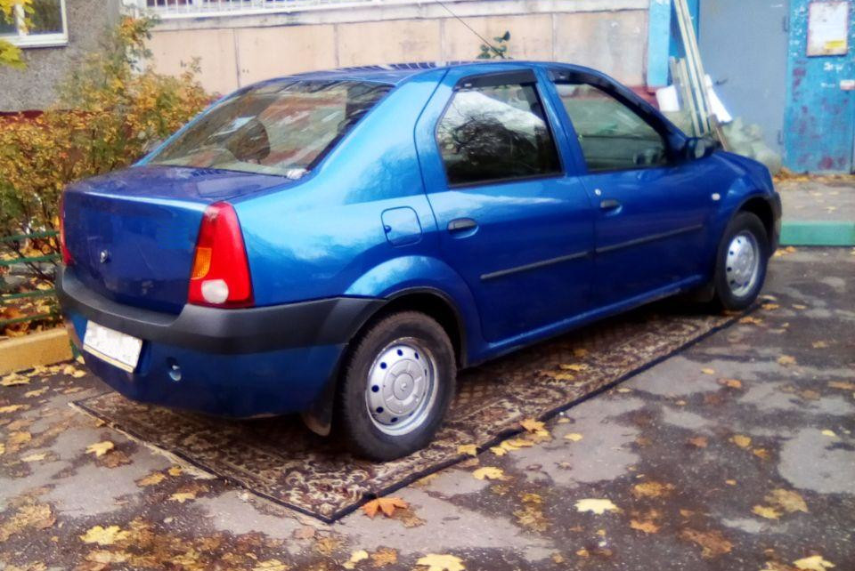
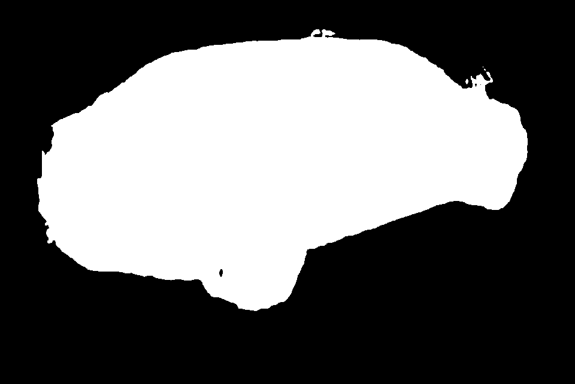
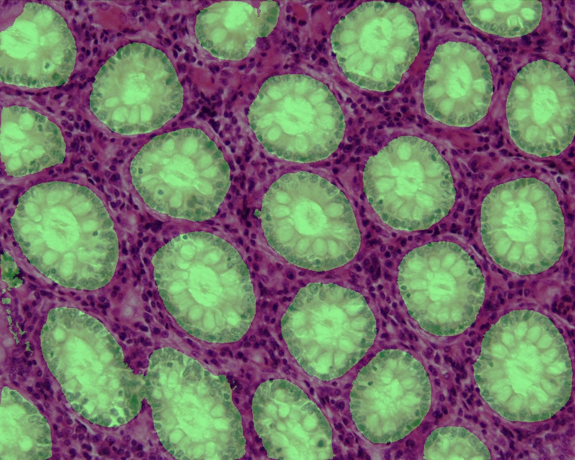

# Semantic segmentation

This module demonstrates semantic segmentation based on Intel's [semantic-segmentation-adas-0001](https://github.com/opencv/open_model_zoo/blob/master/models/intel/semantic-segmentation-adas-0001/description/semantic-segmentation-adas-0001.md) deep learning network. To complete this module, you should implement:

1. `dice` score metric computation for binary masks
2. `ADAS::segment` method which performs image semantic segmentation for the sollowing classes:

    ```
    road, sidewalk, building, wall, fence, pole, traffic light, traffic sign,
    vegetation, terrain, sky, person, rider, car, truck, bus, train, motorcycle,
    bicycle, ego-vehicle
    ```

     

3. (optional) Make your own image blending with test or custom image. Attach the
result with opened pull request.

    

4. (required) Implement glands counter with help of [UNet Histology](https://github.com/NifTK/NiftyNetModelZoo/tree/5-reorganising-with-lfs/unet_histology) model from [NiftyNet](https://github.com/NifTK/NiftyNet) zoo. The following steps should be done:

    1. `bgr2rgb` preprocessing procedure which converts BGR color image to RGB
    2. `normalize` preprocessing procedure which does per-channel mean variance image normalization
    3. Add TensorFlow model conversion command into `.travis.yml` configuration file
    4. `UNetHistology::segment` method to perform image segmentation
    5. `countGlands` method which should estimate number of glands by segmentation mask

    

## Details

* Download trained semantic segmentation network from [Open Model Zoo](https://github.com/opencv/open_model_zoo) and put to `openvino_practice/data`:

    * [semantic-segmentation-adas-0001.bin](https://download.01.org/opencv/2020/openvinotoolkit/2020.3/open_model_zoo/models_bin/1/semantic-segmentation-adas-0001/FP32/semantic-segmentation-adas-0001.bin)
    * [semantic-segmentation-adas-0001.xml](https://download.01.org/opencv/2020/openvinotoolkit/2020.3/open_model_zoo/models_bin/1/semantic-segmentation-adas-0001/FP32/semantic-segmentation-adas-0001.xml)

* Download [frozen_unet_histology.pb](https://www.dropbox.com/s/hhu6ojkgru93poh/frozen_unet_histology.pb?dl=1) TensorFlow model from and put to `openvino_practice/data`

* Use OpenVINO Model Optimizer to get IR files (`.xml` and `.bin`). Note that
original TensorFlow network accepts tensors of shape `1,952,1144,1,1,3` which
should be specified during conversion.

* Do not add model files (`.pb` or `.xml` or `.bin`) into commit (it is downloaded automatically on CI)
