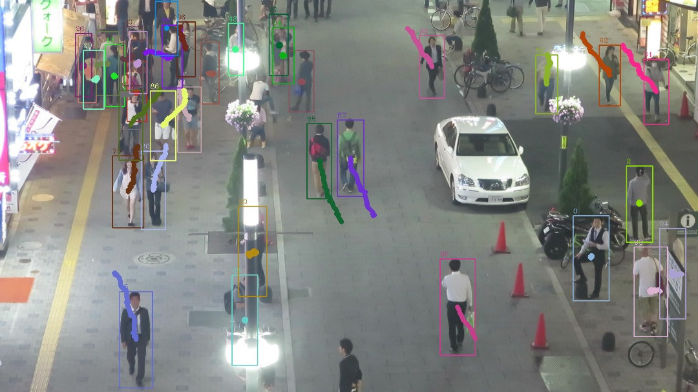

# Tracking

## General description

This module demonstrates tracking approach based on the decision of the assignment problem.

This is a full-functional code of a tracking algorithm, but we removed
implementations of the following three methods of the class Tracker (file `tracker.py`):
* `_calc_affinity_appearance`
* `_calc_affinity_position`
* `_calc_affinity_shape`

The task is to implement these methods such that the code of tracking algorithm
works and passes the tests.



## How it works

This implementation of the tracking algorithm is intended for making pedestrian tracking
on one video from the MOT17 dataset.

Instead of running a pedestrian detector on each input frame this implementation
reads the detections from the text annotation file `annotation.txt`.
This simplifies the code and make it work faster.

Note that the file `annotation.txt` contains for each frame
* bounding boxes of pedestrians for each frame
* appearance features for each pedestrian
The appearance features may be used in the tracking algorithm to distinct pedestrians.
(Note that the appearance features were calculated using 3-d RGB color histograms of the pedestrians.)

## How to run it

To run the code download the annotation file and images from
[the archive tracking_data.zip](https://mega.nz/#!gQlnAADB!ioLngYD5bK9P7_lhgybkiShonOauMMQ6EUDvJRUoY2A)

The archive contains the following files
```
├── annotation
│   └── annotation.txt -- annotation file to run the tracking application
└── MOT17-04-FRCNN
    ├── gt
    │   └── gt.txt
    └── img1   ---- folder with images
        ├── 000001.jpg
        ├── 000002.jpg
        │   ...
        ├── 001049.jpg
        └── 001050.jpg
```

You can run the tracking algorithm using the following command line
on Linux:
```
python main.py --annotation <path_to_unzipped_archive>/annotation/annotation.txt --dst_folder ./DST1/
```
on Windows:
```
python main.py --annotation <path_to_unzipped_archive>\annotation\annotation.txt --dst_folder .\DST1\
```
This will run the tracking algorithm on the input, read from the annotation file,
and write the results to the files in the destination folder `DST1`.

If you want to write images, demonstrating how the tracking algorithm works, to the destination folder
add the following command line parameter:
```
--images_folder <path_to_unzipped_archive>/MOT17-04-FRCNN/img1/
```
(this for Linux, for Windows the command line parameter will be analogous)

If you want also to see the images demonstrating how the tracking works, add also the command
line parameter `--show`

Also the command line parameter `--probability_miss_detection` may be used to emulate reallife issues
concerning misses of detector. The parameter points the probability that a detection from the annotation file
will be "missed", the greater the parameter the worse the detector.
By default the parameter value is `0.6` to emulate the standard detector issues.

## Testing

The file `test_tracking.py` contains the test for the tracking algorithm.

It runs the tracking application with several different values `--probability_miss_detection`,
collects the results, and compares the results with the thresholds.o

To pass the test the tracking application should work sufficiently good for all checked parameters
`--probability_miss_detection`.

## Source code

The most important files in the source code of the tracking algorithm are as follows:
* `main.py` -- the main file to run the tracking application
* `tracker.py` -- the file with the tracking algorithm itself; contains the logic and the main functions making tracking
* `common/common_objects.py` -- the basic objects (bbox, DetectedObject) and functions to work with them
    (`calc_bbox_area`, calc_IoU`, etc)
* `common/feature_distance.py` -- contains the function `calc_features_similarity` to calculate
    similarity of appearance features

## The general purpose of the task

The general purposes of this task are:
* Learn how works a full implementation of a tracker algorithm
* Check different implementations of affinity metrics between detected objects and tracks
* Enjoy
