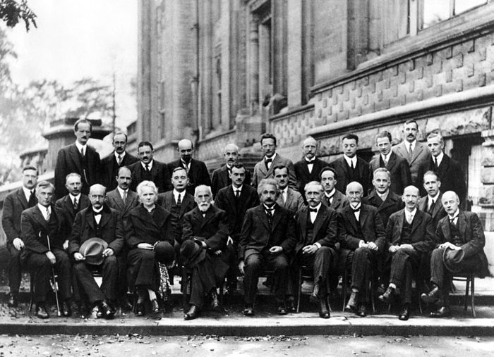
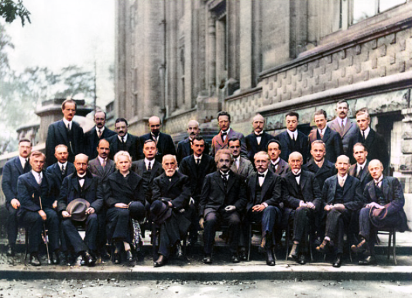

# Image colorization

This module demonstrates image colorization network from [DeOldify](https://github.com/jantic/DeOldify/).
You will also learn how to use OpenVINO in Python.
To complete this module you should implement:

1. `colorize` method runs network with input image
2. `postprocess` procedure that applies some transformations to output of the network to get final colored image
3. Apply implemented algorithm to any custom image and add it to pull request description

     

## Details

* Download converted model from here:

  * [deoldify.xml](https://mega.nz/#!cBcHTA6Y!1FIiHhDCLSbW_Ba4zVIbSNQGgJB8mTCEjMjYgSwPh5M)
  * [deoldify.bin](https://mega.nz/#!9cFFwAQb!NwSZ_j35wCcD9LUEbw9yrp-DsT37AvGQB5YWtfw3-0w)

* Setup OpenVINO environment

    * Linux

        ```bash
        source /opt/intel/openvino/bin/setupvars.sh
        ```

    * Microsoft Windows

        ```bat
        "C:\Program Files (x86)\IntelSWTools\openvino\bin\setupvars.bat"
        ```

* Run a test Python script:

    ```
    python3 test_colorization.py
    ```

* Do not add `.xml` and `.bin` files into commit - they are downloaded automatically on CI
