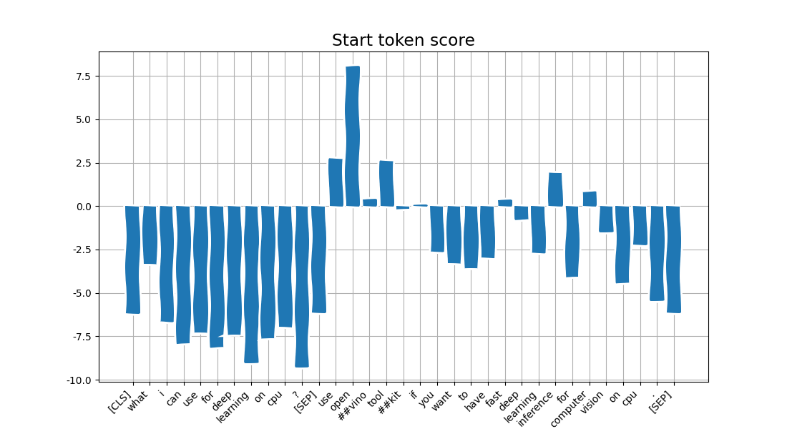
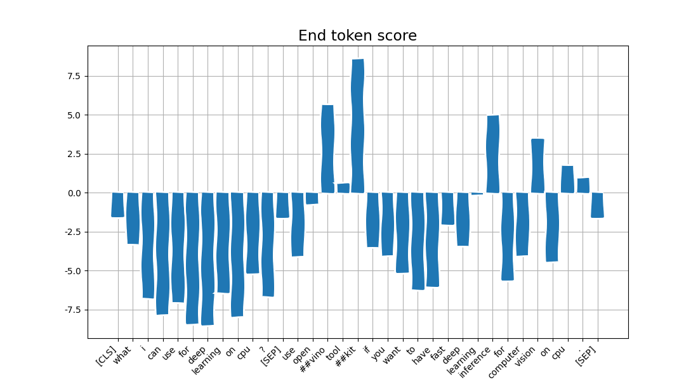

# Natural Language Processing (NLP)

This module demonstrates one of the Natural Language Processing tasks - question-answering problem.
It uses DistilBERT model from Hugging Face project: https://github.com/huggingface/transformers/tree/master/examples/distillation

1. `basicTokenize` method which splits input sentence on works by whitespaces and punctuation
2. `getAnswer` method which runs neural network and returns an answer for specific question-source pair.
3. Choose your own text and question for it and precict an answer. Write it in the following files:
    * `data/my_squad_question.txt`
    * `data/my_squad_source.txt`
    * `data/my_squad_answer.txt`

## Details

* DistilBERT model (`distilbert-base-uncased-distilled-squad`) has been already converted
into OpenVINO format and you may download IR files:

  * [distilbert.xml](https://mega.nz/#!IZE0iYaT!XR9MdIy7B4EqVKOiiHppmliRf6E4ov_rtKs18wmyx3I)
  * [distilbert.bin](https://mega.nz/#!lAEwmKKS!1uNNTyrBkROtYjJMeUB6bEMpppwud2TsRVokOvVR09s)

* Do not add model files (`.xml` and `.bin`) into commit (it is downloaded automatically on CI)

* First, both question and source texts are tokenized:
    ```
    question: "What I can use for deep learning on CPU?"
    tokens:   ["what", "i", "can", "use", "for", "deep", "learning", "on", "cpu", "?"]


    source: "Use OpenVINO toolkit if you want to have fast deep learning inference for computer vision on CPU."
    tokens: ["use", "open", "##vino", "tool", "##kit", "if", "you", "want", "to", "have",
             "fast", "deep", "learning", "inference", "for", "computer", "vision", "on", "cpu", "."]
    ```

    note that if there is no word in vocabulary (see `data/bert-large-uncased-vocab.txt`) we try
    to split a word by smaller parts with special symbols `##`.

* Next, question and source tokens are merged together using specials separators.
Then tokens are replaed in corresponding position indices from a vocabulary (see `data/bert-large-uncased-vocab.txt`)

    ```
    tokens: ["[CLS]", "what", "i", "can", "use", "for", "deep", "learning", "on", "cpu", "?",
             "[SEP]", "use", "open", "##vino", "tool", "##kit", "if", "you", "want", "to",
             "have", "fast", "deep", "learning", "inference", "for", "computer", "vision",
             "on", "cpu", ".", "[SEP]"]

    indices: [101, 2054, 1045, 2064, 2224, 2005, 2784, 4083, 2006, 17368, 1029, 102,
              2224, 2330, 26531, 6994, 23615, 2065, 2017, 2215, 2000, 2031, 3435,
              2784, 4083, 28937, 2005, 3274, 4432, 2006, 17368, 1012, 102]
    ```

* Network produces two outputs - both have 1x128 shape and indicate start and end token of answer in input sequence.

    

    

* Finally, answer is subtracted from source text: `openvino toolkit`
