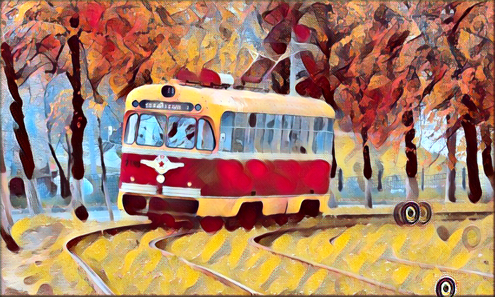
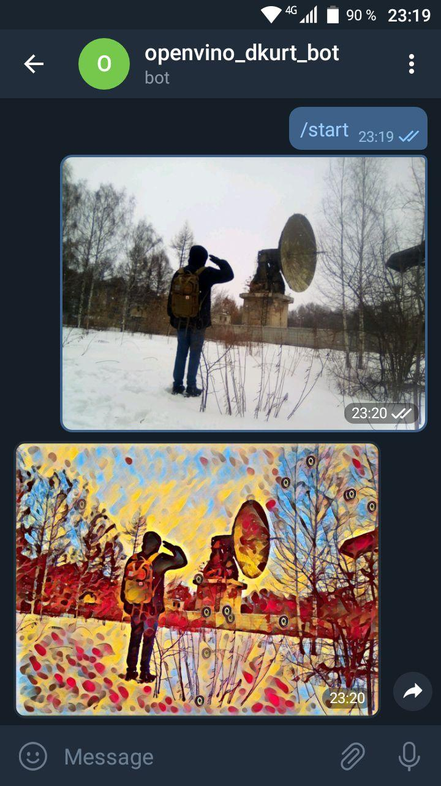

# Quantization

This module will show you how to

* Run style transfer deep learning network from [PyTorch](https://github.com/pytorch/examples/tree/master/fast_neural_style)

* Quantize OpenVINO network from FP32 weights precision to INT8

* Create a Telegram bot which performs image processing by request

To complete this module you should

1. Implement FP32 model inference in `style_transfer.py`

     


2. Run quantization script to get optimized model

3. Create a Telegram bot with a name `openvino_<username>_bot`, process images and
add a screenshot with working bot to pull request description.


    


## Details

* Download FP32 model:

  * [candy.xml](https://mega.nz/#!lNFWyagB!DPTHP8OKDDB9wcrshvQxcTSRAbyrgeUHKeVOYyiFss0)
  * [candy.bin](https://mega.nz/#!NMV02agL!APdG2lwOvEKy5oqMwMKpRJJxNPIGDY4hSm3hpY9kj7M)

### Quantization

* Download and unpack Microsoft COCO validation dataset (5000 images): http://images.cocodataset.org/zips/val2017.zip

* To run `quantize.py`, setup OpenVINO environment and set extra variable:

  * Linux

      ```bash
      export PYTHONPATH=/opt/intel/openvino/deployment_tools/tools/post_training_optimization_toolkit/:$PYTHONPATH
      ```

  * Windows

      ```bat
      set PYTHONPATH=C:\Program Files (x86)\IntelSWTools\openvino\deployment_tools\tools\post_training_optimization_toolkit;%PYTHONPATH%
      ```

* Add quantized model to `openvino_practice/data` folder - you will find it in `./optimized` subfolder after script finished.

### Telegram bot

0. Install Python API library

    ```bash
    python3 -m pip install pytelegrambotapi
    ```

1. Find `@BotFather` user in Telegramm app (make sure it's approved user)

2. Type `/newbot`

3. Choose name which ends with `_bot`: `openvino_<username>_bot`

4. Copy token and run `bot.py` with it:

    ```bash
    python3 bot.py --token xxxxxxx
    ```
